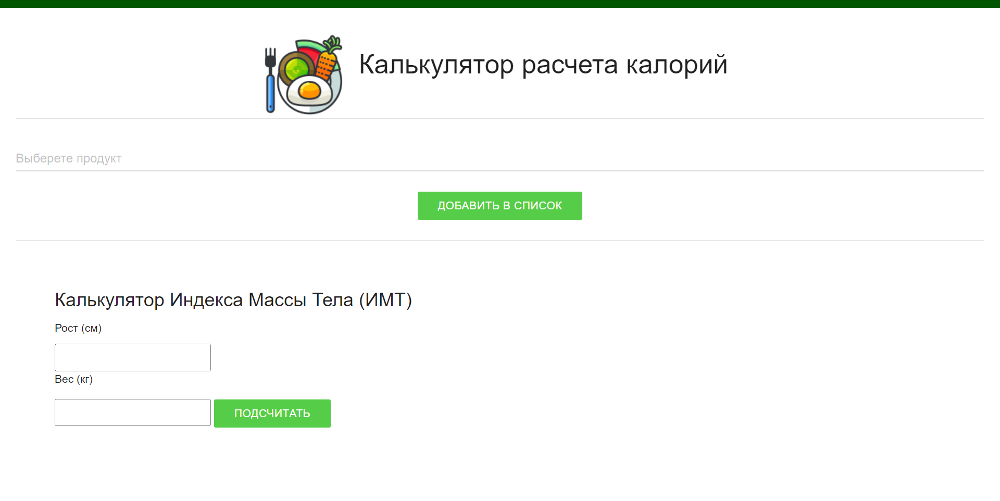

[](https://github.com/psf/black)
[](http://mypy-lang.org/)
[](https://www.travis-ci.com/github/vyahello/calorie-counter)
[](https://coveralls.io/github/vyahello/calorie-counter?branch=master)
[](https://pypi.python.org/pypi/calorie-counter/)
[](https://pypi.python.org/pypi/calorie-counter/)
[](https://pypi.python.org/pypi/calorie-counter)
[](https://www.codefactor.io/repository/github/vyahello/calorie-counter)
[](https://hub.docker.com/repository/docker/vyahello/calorie-counter)

# Калькулятор расчета калорий
> Этот проект представляет собой простое веб-приложение для расчета калорий на основе заданного типа пищи.

## Инструменты разработки
- front-end
  - html5
  - css3
  - javascript
- back-end
  - python 3.10
  - [flask](http://flask.palletsprojects.com)

### Быстрый страт

Используйте следующую команду для запуска приложения через docker:
```bash
docker run -it -p 5001:5001 vyahello/calorie-counter:0.1.0 counter
```

Откройте http://0.0.0.0:5001

### Исходный код

Чтобы иметь возможность запускать исходный код, пожалуйста, выполните приведенную ниже команду:
```bash
git clone https://github.com/NasPozd/CalCaloro.git
cd calorie-counter
pip install -r requirements.txt
python -m counter --bind 0.0.0.0:5001 --debug
```

Также вы можете использовать **flask** встроенный раннер на основе конфигурационного файла [.flaxen](.flaxen):
```bash
export FLASK_APP=counter
flask run
```

Then please open [localhost:5003](http://localhost:5003) endpoint in your browser.

### Установка PYPI 

Запустите следующий скрипт, чтобы получить актуальный пакет из PYPI:
```bash
pip install calorie-counter
```
Затем выполните приведенные ниже инструкции, чтобы запустить его из вашей среды:
```python
>>> from counter import Bind, easyrun
>>> 
>>> easyrun(Bind("0.0.0.0:5003"))
```
Затем откройте [localhost:5003](http://localhost:5003 ).

### Создание образов docker

Чтобы создать базовый образ выполните следующую команду:
```bash
docker build --no-cache -t calorie-counter:0.1.0 -f docker/Dockerfile .
```

Чтобы создать основной образ выполните следующую команду:

```bash
docker build --no-cache -t calorie-counter:test -f docker/Dockerfile --build-arg VERSION=0.1.0 .
```

Используйте следующие команды для отправки образа:
```bash
docker push calorie-counter:test
```

### Meta
Над проектор работали студенты ИНБО-07-20
```bash
Позднякова А.О.
Воронкова А.В.
Рыжило А.В.
Мацоян А.К.
```
